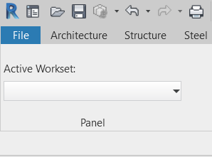

# RevitUndocumentedAPI

Some useful Revit API function which is not documented. Use at your own risk.

## RibbonLabelCommand
Using functions from AdWindows.dll to create a label on Ribbon panel in Revit.

Inspired by [Simulating a Ribbon Textbox Label](https://thebuildingcoder.typepad.com/blog/2010/09/simulating-a-ribbon-textbox-label.html)
